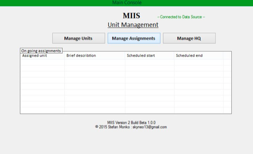

# Milsim Inteligence and Information System v2

  
Set of application to easy manage information during large or small scale airsoft and milsim events.  
```
This is very early beta version, but already field tested during bing international MilSim event.
```

Download: `Beta build 1.1.0` https://sourceforge.net/projects/miisp/  

#### Working modules:

``Unit and Assignment management`` - To create and manage units, task/missions, plan them and assign them to units  

``Radio log`` -Record messages from your radio post / radio chats  

``Report tool`` - To create, manage, export or print detailed mission and game statics  

``Bio data`` - Create and manage list of persons in your game such as wanted persons, checked civilians, enemy POW etc.

#### WIP modules:

``Intel database`` - To do - Create and manage any information such as reports, codes, passwords, maps, pictures usefull for your game Intelligence

``Unit tracker`` - Track your units real time on fieald using GSM and GPS technologie

``Sync service and central storage`` - Store and synch all data within your game side, command, organisators, game masters etc.


## Maintainer

`This project is no longer maintained and develop !`  
If you wish to continue or use this project as code base / idea, feel free to do it.
